<p align="center">
  <span style="color: #FF6B6B; font-size: 28px; font-weight: bold;">
    F1 Practical Course
  </span>
  <br><br>
  <span style="color: #f2e5e5; font-size: 18px; font-weight: bold;">
    CCTB Würzburg | Chair for Computational & Theoretical Biology
  </span>
</p>


</div>

<p align="center">
  <span style="color: #6b8eff; font-size: 26px; font-weight: bold;">
    3D Nuclear Segmentation Using ImageJ and Python
  </span>
</p>


<p align="left">
  <font color="#f32024" size="16"><b>Introduction</b></font>
</p>


3D nuclear segmentation is critical for quantitative analysis of mouse blastocyst embryos, enabling measurements of nucleus volume, shape, intensity, and spatial distribution essential for developmental biology studies. This 3D fluorescence microscopy stacks of mouse embryo sections stained with DAPI, a fluorescent dye  to visualize nuclear DNA. Samples were acquired as 78-slice Z-stacks (512×512 pixels) using laser scanning microscopy, capturing complete cellular volumes across multiple fields of view (FOVs). The specific goal is to accurately segment and count nuclei (~78 per FOV) across the full Z-depth, addressing challenges like out-of-focus top slices and touching nuclei that confound 2D analysis.


<p align="LEFTSIDE">
  <span style="color: #f32024; font-size: 26px; font-weight: bold;">
     Table of Content
  </span>
</p>


- MATERIALS AND METHODS
- Workflow
  - ImageJ
  - python 2D and 3D
- Results
- Discussion


<p align="left">
  <font color="#f32024" size="16"><b>Materials and Methods</b></font>
</p>


Dataset: 78-slice 3D DAPI stacks (shape: Z=78, Y=512, X=512) from mouse embryo LSM files.
Software:Python 3.12 with scikit-image 0.24.0 (image processing), scipy 1.13.1 (distance transforms), numpy 1.26.4 (arrays), pandas 2.2.2 (measurements),
 matplotlib 3.8.4 (visualization)

Fiji/ImageJ 2.15.0 with MorphoLibJ (3D watershed), 3D Objects Counter (validation)

---

<p align="center">
  <font color="#5419cb" size="10"><b>A. Workflow with ImageJ for Mouse Embryo Blastocyst</b></font>
</p>


#### 1. Load and smooth the 3D DAPI stack
Open the C–Z hyperstack, pick the DAPI channel  having z‑stack .
Apply a 3D Gaussian filter. Process → Filters → Gaussian Blur 3D…, 

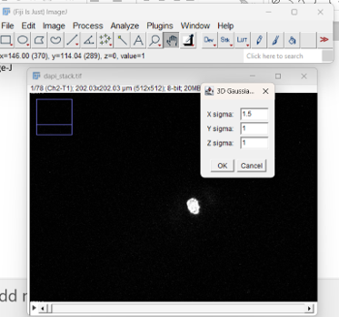


#### 2. Binarisation (thresholding) in 3D
On the blurred stack, use Image → Adjust → Threshold…, tick “Stack”, choose a method like Otsu, adjust if needed so nuclei are red and background is not, then click “Apply” to get a binary 3D mask (nuclei = white, background = black).

This is the direct 3D analogue of your 2D threshold step; parameter to tune: threshold value / method.

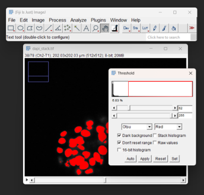

#### 3. 3D dilation and erosion
Use 3D morphology to clean the binary mask and fix small gaps: options depend on your plugins, e.g. Plugins → 3D ImageJ Suite → Filters → Minimum / Maximum (erosion/dilation) or a 3D mathematical morphology command.

As in 2D, you can use opening (erosion then dilation) to remove tiny objects, and closing (dilation then erosion) to fill small holes; tune the structuring element radius to roughly match your 3D nuclei size in voxels.


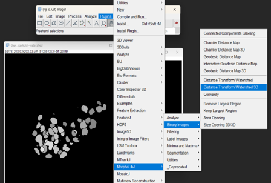

#### 4. 3D watershed to split touching nuclei

With a cleaned binary 3D mask, create a distance map and watershed:with the plugin MorphoLibJ:Plugins → MorphoLibJ → Segmentation → Distance Transform Watershed 3D…, use the binary mask as input, set connectivity (6/26) and “Dynamic 1/2” value to control how aggressively touching nuclei are split.The output showed a labeled 3D image where each nucleus has a different integer label; tuning here is mainly the “dynamic/minima” settings and connectivity to avoid over‑ or under‑segmentation.

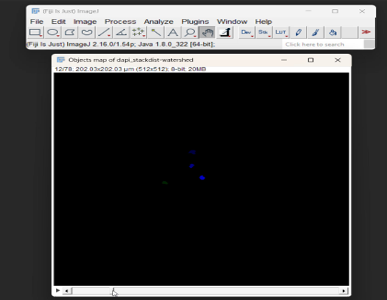

#### 5. Count and inspect nuclei
Use Analyze → 3D Objects Counter and further with Roi manager
In total “184 objects detected with the data showing volume, mean and max intensity, centroid, and special locations.” 


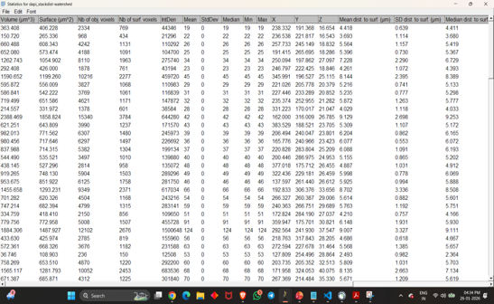


## **B. Workflow  with Python in 2D for a FOV**

     
  


####  1. load one fov use DAPI / nuclear channel

<details>
  <summary><strong><small>Show Code for Step 1</small></strong></summary>

```bash
path = r"D:/F1_CCTB/data/S-BSST700/selected-tiles/selected-tiles/out_opt_flow_registered_X11_Y4_c03_DAPI.tif"
img = io.imread(path)
```
</details>

#### 2. Preprocessing: smooth to reduce noise


<details>
  <summary><strong><small>Show Code for Step 2</small></strong></summary>

```bash
smoothed = filters.gaussian(img, sigma=1.5)
```
</details>

#### 3. Thresholding: separate nuclei from background


<details>
  <summary><strong><small>Show Code for Step 3</small></strong></summary>

```bash
thr = filters.threshold_otsu(smoothed)
binary = smoothed > thr

binary = morphology.remove_small_objects(binary, min_size=100)
binary = morphology.remove_small_holes(binary, area_threshold=100)
```
</details>

#### 4. Distance transform + watershed for instance separation


<details>
  <summary><strong><small>Show Code for Step 4</small></strong></summary>

```bash
distance = ndi.distance_transform_edt(binary)
local_max = morphology.local_maxima(distance)
markers, _ = ndi.label(local_max)
labels = segmentation.watershed(-distance, markers, mask=binary)

```
</details>

#### 5. Filter by area (remove very small + very big objects)


<details>
  <summary><strong><small>Show Code for Step 5</small></strong></summary>


```bash
min_area = 80      # too small  -> fragments
max_area = 2000  # too large -> debris

props = measure.regionprops(labels)
mask_keep = np.zeros_like(labels, dtype=bool) 

for p in props:
    if min_area <= p.area <= max_area: #Checks whether this object’s size lies in the allowed range (nucleus-sized).
        mask_keep [labels == p.label] = True
# mask_keep is True only for pixels that belong to objects within the chosen area range; all other objects (too small or too big) remain False and will be removed when you relabel.
labels = measure.label(mask_keep)

```
</details>


#### 6. Count nuclei


<details>
  <summary><strong><small>Show Code for Step 6</small></strong></summary>

```bash 

n_nuclei = labels.max()
print("Number of nuclei:", n_nuclei)


fig, axes = plt.subplots(1, 3, figsize=(15, 5))
axes[0].imshow(img, cmap="gray")
axes[0].set_title("Original DAPI")
axes[0].axis("off")

axes[1].imshow(binary, cmap="gray")
axes[1].set_title("Binary mask")
axes[1].axis("off")

overlay = color.label2rgb(labels, image=img, bg_label=0, alpha=0.3)
axes[2].imshow(overlay)
axes[2].set_title(f"Labeled nuclei (count = {n_nuclei})")
axes[2].axis("off")

plt.tight_layout()
plt.show()

```
</details>

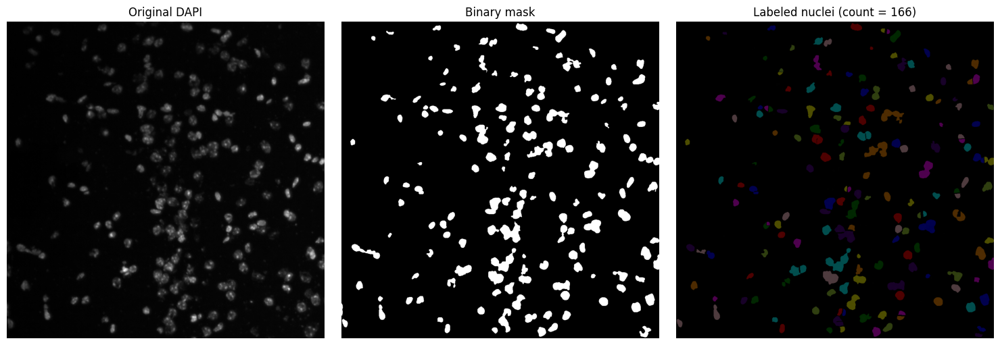


## **Workflow  with Python in 3D For Mouse Embryo Blastocyst**

This Python workflow explains the nuclei segmentation of  DAPI-labeled 3D stacks of mouse blastocysts  through  Gaussian smoothing → Otsu thresholding → morphological cleanup → distance transform watershed → quantitative analysis. Where the parameters detected ~192 nuclei per embryo with volume, centroid, and intensity measurements.

### **1. Import  Library and load 3D DAPI Stack**
- Loads a `.tif` stack using `skimage.io.imread`.
- Displays representative slices (first, middle, last).
- Prints voxel dimensions. 


<details>
  <summary><strong> Show Code for Step 1</strong></summary>

```bash
import numpy as np
import matplotlib.pyplot as plt
import pandas as pd

from skimage import io
from skimage.filters import threshold_otsu
from scipy.ndimage import gaussian_filter
from scipy import ndimage as ndi
from skimage.measure import regionprops_table
from skimage.color import label2rgb

dapi = io.imread("dapi_stack.tif")
print("DAPI shape:", dapi.shape, "dtype:", dapi.dtype)

```
</details>

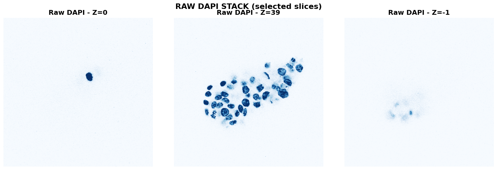

### **2. 3D Gaussian Smoothing**

3D Gaussian Smoothing is a technique used to reduce noise and detail in 3D data, such as volumetric images or point clouds, by convolving the data with a 3D Gaussian kernel.
- Applies anisotropic Gaussian blur:  
  - Stronger smoothing in Z (`σ = 1.5`)  
  - Moderate smoothing in XY (`σ = 1.0`)  
- Reduces noise and improves thresholding stability. 

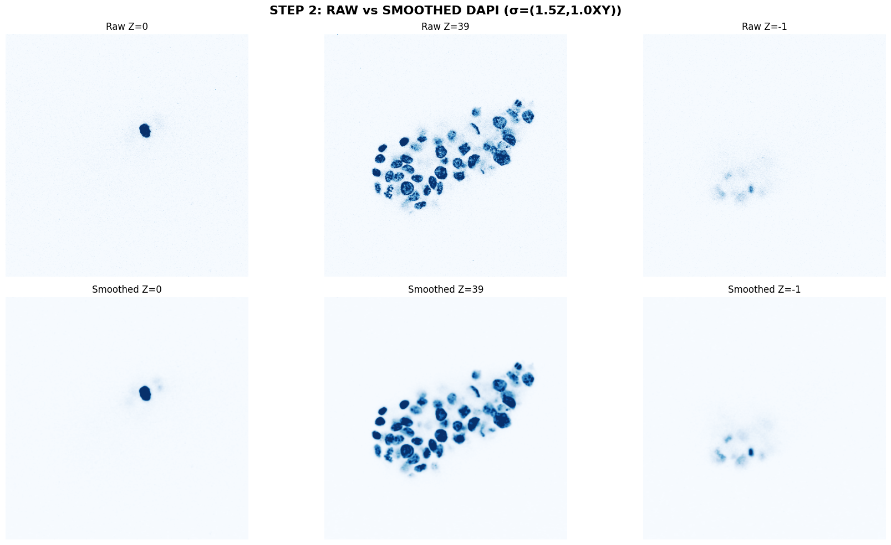
<details>
  <summary><strong> Show Code for Step 2</strong></summary>

```bash
print("\n🔍 STEP 2: 3D Gaussian smoothing (stronger Z smoothing)...")
dapi_blur = gaussian_filter(dapi, sigma=(1.5, 1.0, 1.0))
print("    Blurring complete")

# Compare raw vs smoothed
fig, axes = plt.subplots(2, 3, figsize=(18, 10))
slices = [0, dapi.shape[0]//2, -1]
for i, z in enumerate(slices):
    # Raw
    axes[0, i].imshow(dapi[z], cmap='Blues', vmax=np.percentile(dapi, 99))
    axes[0, i].set_title(f'Raw Z={z}', fontsize=12)
    axes[0, i].axis('off')
    
    # Smoothed
    axes[1, i].imshow(dapi_blur[z], cmap='Blues', vmax=np.percentile(dapi_blur, 99))
    axes[1, i].set_title(f'Smoothed Z={z}', fontsize=12)
    axes[1, i].axis('off')
plt.suptitle('STEP 2: RAW vs SMOOTHED DAPI (σ=(1.5Z,1.0XY))', fontsize=16, fontweight='bold')
plt.tight_layout()
plt.show()

```
</details>

### **3. Otsu Thresholding + Morphological Cleanup**

Otsu Thresholding is an automated image segmentation technique that determines the optimal threshold to separate an image into two classes (e.g., foreground and background) by minimizing the intra-class variance or maximizing the inter-class variance.Morphological Cleanup is applied after Otsu thresholding to refine the segmented output by removing noise and small artifacts. 
- Computes global Otsu threshold.
- Removes small objects.
- Closes small gaps using a 3D structuring element.
- Fills small holes.
- Counts initial “blobs” before splitting.


<details>
  <summary><strong> Show Code for Step 3</strong></summary>

```bash
print("\n STEP 3: Otsu thresholding + cleanup...")
thr = filters.threshold_otsu(dapi_blur)
print(f"   Otsu threshold: {thr:.1f}")

nuclei_mask = dapi_blur > thr
nuclei_mask = morphology.remove_small_objects(nuclei_mask, min_size=30)
nuclei_mask = morphology.binary_closing(nuclei_mask, morphology.ball(1))
nuclei_mask = morphology.remove_small_holes(nuclei_mask, area_threshold=50)

# Count raw blobs
labels_temp, num_blobs = morphology.label(nuclei_mask, connectivity=2, return_num=True)
print(f"    Clean mask ready: {num_blobs} raw blobs found")

# Show binary mask progression
fig, axes = plt.subplots(2, 4, figsize=(20, 10))
test_slices = [10, 25, 39, 55]

for i, z in enumerate(test_slices):
    col = i % 4
    
    # Original
    axes[0, col].imshow(dapi[z], cmap='Blues')
    axes[0, col].set_title(f'Original Z={z}', fontsize=12)
    axes[0, col].axis('off')
    
    # Binary mask
    axes[1, col].imshow(nuclei_mask[z], cmap='gray')
    axes[1, col].set_title(f'Mask Z={z}\n({np.sum(nuclei_mask[z])} px)', fontsize=12)
    axes[1, col].axis('off')

plt.suptitle('STEP 3: BINARY NUCLEI MASK AFTER CLEANUP', fontsize=16, fontweight='bold')
plt.tight_layout()
plt.show()


```

</details>


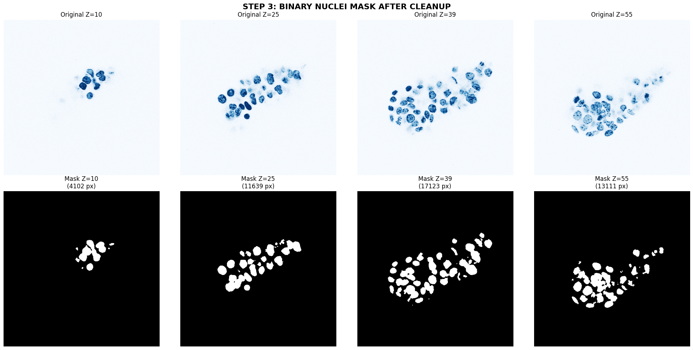

### **4. Distance Transform + Peak Detection**

Distance Transform is a key step in image segmentation, particularly when used with the Watershed Algorithm in OpenCV.  It computes the distance from each foreground pixel to the nearest background pixel, creating a distance map where peaks correspond to the centers of objects. These peaks are then identified by thresholding the distance-transformed image and applying morphological operations like dilation to isolate distinct regions.
- Computes Euclidean distance transform inside nuclei.
- Detects local maxima as **nuclear centers**.
- Uses `peak_local_max` with a 3D footprint.
- Visualizes markers on selected slices.


<details>
  <summary><strong> Show Code for Step 4</strong></summary>

```bash
print("\n STEP 4: Distance transform + peak markers...")
distance = distance_transform_edt(nuclei_mask)

coords = feature.peak_local_max(
    distance, min_distance=8, 
    footprint=np.ones((7,7,7)), 
    threshold_abs=1.5, labels=nuclei_mask
)
print(f"    {len(coords)} nuclear center markers detected")

# Visualize distance + markers
fig, axes = plt.subplots(2, 4, figsize=(20, 10))
for i, z in enumerate(test_slices):
    col = i % 4
    
    # Distance transform
    axes[0, col].imshow(distance[z], cmap='viridis')
    axes[0, col].set_title(f'Distance Z={z}', fontsize=12)
    axes[0, col].axis('off')
    
    # Markers overlaid
    mk_slice = np.zeros_like(nuclei_mask[z])
    marker_z = coords[:,0] == z
    if np.any(marker_z):
        mk_slice[coords[marker_z,1], coords[marker_z,2]] = 1
    axes[1, col].imshow(nuclei_mask[z], cmap='gray', alpha=0.7)
    axes[1, col].scatter(coords[marker_z,2], coords[marker_z,1], c='red', s=50)
    axes[1, col].set_title(f'Markers Z={z}\n({np.sum(marker_z)})', fontsize=12)
    axes[1, col].axis('off')

plt.suptitle('STEP 4: DISTANCE MAP + RED MARKERS (nuclear seeds)', fontsize=16, fontweight='bold')
plt.tight_layout()
plt.show()

```

</details>

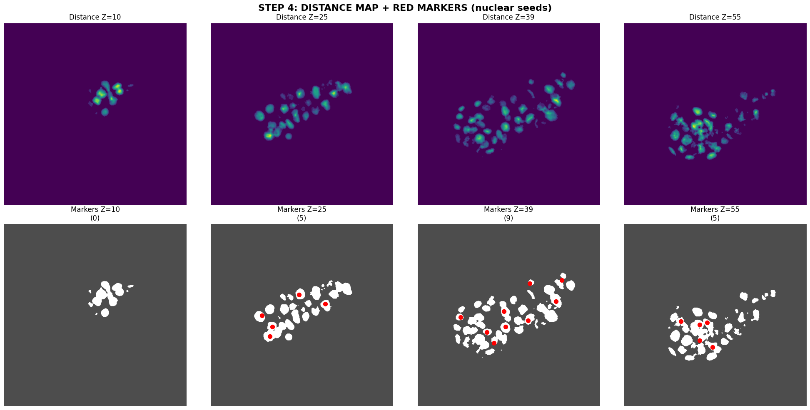

### **5. Marker‑Controlled Watershed Segmentation**

technique used to separate touching or overlapping objects in an image by simulating the flooding of a topographic surface from predefined seed points, known as markers.
- Seeds = detected peaks.
- Watershed applied on **negative distance map**.
- Splits touching nuclei.
- Filters out small objects (<200 voxels).
- Produces final labeled 3D segmentation.


<details>
  <summary><strong> Show Code for Step 5</strong></summary>

```bash
print("\n STEP 5: Watershed segmentation...")
markers = np.zeros(distance.shape, dtype=np.int32)
for i, (z,y,x) in enumerate(coords, 1): 
    markers[z,y,x] = i

# Dilate markers for stability
markers = binary_dilation(markers > 0, morphology.ball(2)).astype(np.int32) * markers

# Run watershed
labels = segmentation.watershed(-distance, markers, mask=nuclei_mask)
print(f"   Raw segments: {np.max(labels)}")

# Size filtering (200+ voxels = realistic nuclei)
sizes = np.bincount(labels.ravel())[1:]
keep_labels = np.nonzero(sizes >= 200)[0] + 1
labels_filtered = np.zeros_like(labels)
for new_id, old_id in enumerate(keep_labels, 1):
    labels_filtered[labels == old_id] = new_id

n_nuclei = np.max(labels_filtered)
print(f"    FINAL: {n_nuclei} nuclei after size filtering")

# Show watershed result
fig, axes = plt.subplots(2, 4, figsize=(20, 10))
for i, z in enumerate(test_slices):
    col = i % 4
    
    # Before watershed (blobs)
    axes[0, col].imshow(color.label2rgb(labels_temp[z], dapi[z], alpha=0.6))
    axes[0, col].set_title(f'Blobs Z={z}\n({np.sum(labels_temp[z]>0)})', fontsize=12)
    axes[0, col].axis('off')
    
    # After watershed (separated)
    axes[1, col].imshow(color.label2rgb(labels_filtered[z], dapi[z], alpha=0.6))
    axes[1, col].set_title(f'Segmented Z={z}\n({np.sum(labels_filtered[z]>0)})', fontsize=12)
    axes[1, col].axis('off')

plt.suptitle('STEP 5: BEFORE vs AFTER WATERSHED (touching nuclei split)', fontsize=16, fontweight='bold')
plt.tight_layout()
plt.show()


```

</details>
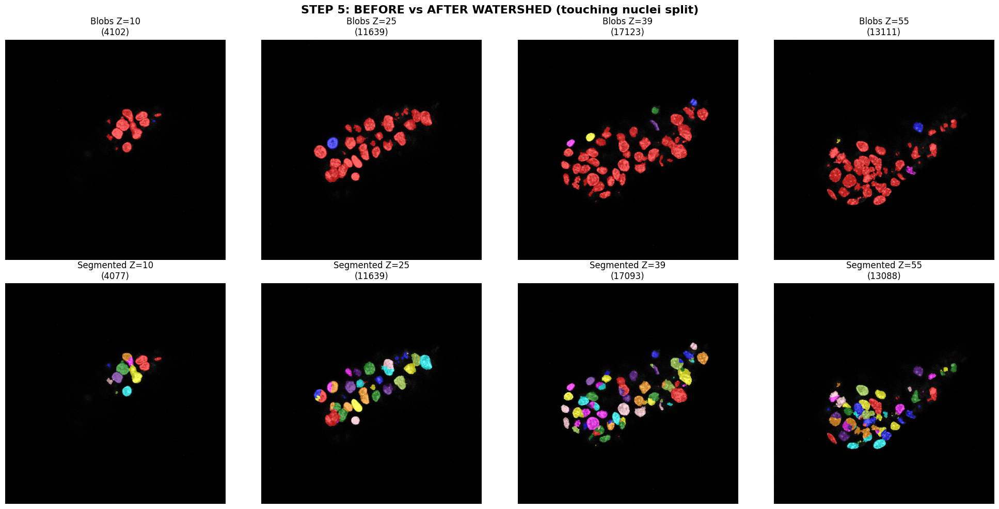

### **6. Quantitative Measurements**
- Extracts per‑nucleus properties:
  - Volume (voxel count)
  - Centroid (x, y, z)
  - Mean DAPI intensity
- Saves results to `nuclei_results.csv`.
- Plots histograms of volume and intensity.

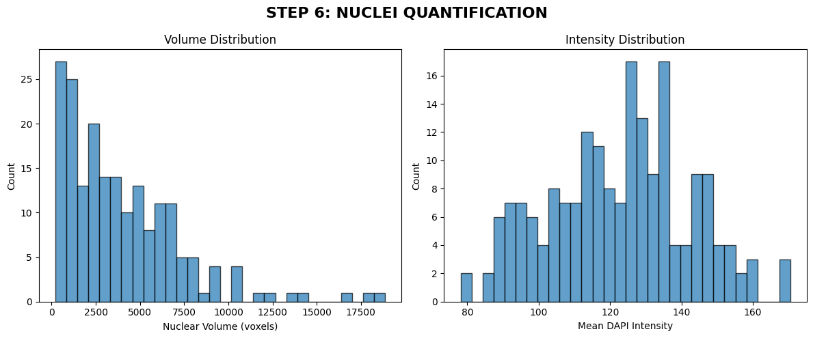
<details>
  <summary><strong> Show Code for Step 7</strong></summary>

```bash
print("\n STEP 6: Measuring nuclear properties...")
props = measure.regionprops_table(labels_filtered, dapi_blur,
    properties=('label', 'area', 'centroid', 'mean_intensity'))
df = pd.DataFrame(props)

print("\nNuclei Statistics:")
print(df[['label', 'area', 'mean_intensity']].describe())

# Save results
df.to_csv("nuclei_results.csv", index=False)
print("    Results saved: nuclei_results.csv")

# Plot distributions
fig, axes = plt.subplots(1, 2, figsize=(12, 5))
axes[0].hist(df['area'], bins=30, alpha=0.7, edgecolor='black')
axes[0].set_xlabel('Nuclear Volume (voxels)')
axes[0].set_ylabel('Count')
axes[0].set_title('Volume Distribution')

axes[1].hist(df['mean_intensity'], bins=30, alpha=0.7, edgecolor='black')
axes[1].set_xlabel('Mean DAPI Intensity')
axes[1].set_ylabel('Count')
axes[1].set_title('Intensity Distribution')

plt.suptitle('STEP 6: NUCLEI QUANTIFICATION', fontsize=16, fontweight='bold')
plt.tight_layout()
plt.show()

```

</details>


### **7. Final 3D Overlay Montage**
- Creates a 4×4 montage of slices every 5 Z‑planes.
- Overlays segmentation labels on raw DAPI.
- Saves final figure as `FINAL_nuclei_3D_overlay.png`.
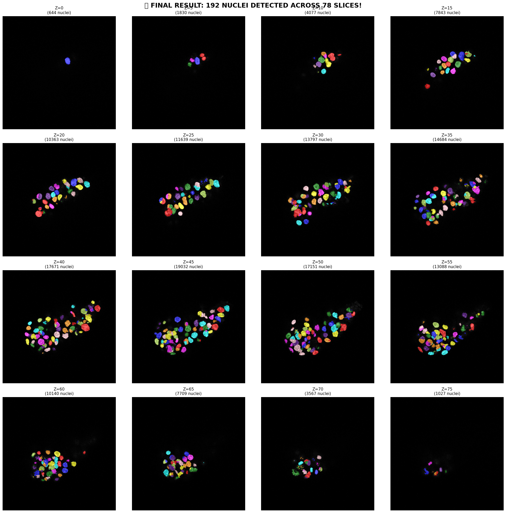

<details>
  <summary><strong> Show Code for Step 7</strong></summary>

```bash

print("\n STEP 7: Final overlay montage...")
fig, axes = plt.subplots(4, 4, figsize=(20, 20))
for i, z in enumerate(range(0, 78, 5)):  # Every 5th slice for better coverage
    if i < 16:
        row, col = i//4, i%4
        overlay = color.label2rgb(labels_filtered[z], dapi[z], alpha=0.6)
        axes[row, col].imshow(overlay)
        axes[row, col].set_title(f'Z={z}\n({np.sum(labels_filtered[z]>0)} nuclei)', fontsize=11)
        axes[row, col].axis('off')

plt.suptitle(f' FINAL RESULT: {n_nuclei} NUCLEI DETECTED ACROSS 78 SLICES!', 
             fontsize=18, fontweight='bold', y=0.98)
plt.tight_layout()
plt.savefig("FINAL_nuclei_3D_overlay.png", dpi=200, bbox_inches='tight')
plt.show()

print(f"\n PIPELINE COMPLETE!")
print(f"   Total nuclei: {n_nuclei}")
print(f"   Results saved: nuclei_results.csv + FINAL_nuclei_3D_overlay.png")
print("=" * 60)

```
</details>


---


# **DISCUSSION**

- Nuclei segmentation in phyton showed 190 objects detected compared to ImageJ 184
- 3D analysis using deep learning methods can be performed.
- Hybrid approaches that combine deep learning with classical image processing could provide better accuracy.
- A count of 180-190 cells could suggest that the embryo is likely at or near the expanded blastocyst stage (day 6–7), consistent    with normal development.


## 📂 Project Structure


project/
│
├── dapi_stack.tif                # Input 3D DAPI image
├── nuclei_results.csv            # Output measurements
├── FINAL_nuclei_3D_overlay.png   # Final visualization
├── segmentation_script.py        # Main pipeline script
└── README.md                     # This file


## 🛠️ Dependencies


